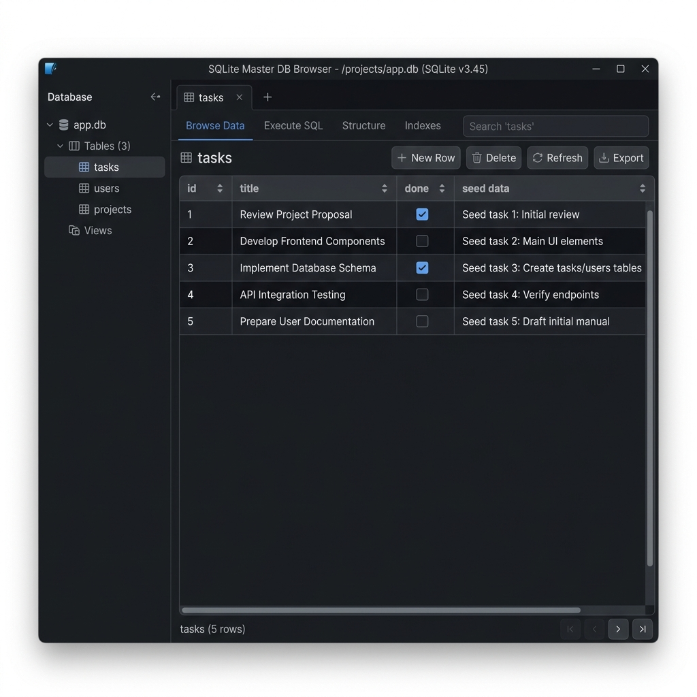

# Task CRUD API with SQLite Database

A lightweight CRUD REST API for managing a to-do list built with **Node.js**, **Express**, and **SQLite** (`better-sqlite3`). Developed as part of the FlyRank Internship Backend Track (Week 3, Assignment A1).

---

## Why SQLite Was Chosen
- **Zero Configuration / Serverless**: SQLite runs in-process directly within Node.js without requiring a separate background database server process (like PostgreSQL or MySQL).
- **Persistent File Storage**: Data persists reliably across application and server restarts in a single portable file (`tasks.db`).
- **Performance & Simplicity**: Fast, synchronous SQL operations provided by `better-sqlite3`, perfect for REST backend APIs.

---

## Database Storage Location
The SQLite database is stored locally in the root directory of the application:
- **File path**: `tasks.db` (`d:\AniA\FlyRankAssignments\WEEK 3\assgn1\tasks.db`)
- **Table Schema**:
  ```sql
  CREATE TABLE IF NOT EXISTS tasks (
    id INTEGER PRIMARY KEY AUTOINCREMENT,
    title TEXT NOT NULL,
    done BOOLEAN NOT NULL DEFAULT 0
  );
  ```

---

## How to Install & Start the Project

1. **Clone the repository and navigate to the project directory**:
   ```bash
   git clone https://github.com/AniA16051/FlyRankweek3Assgn1.git
   cd FlyRankweek3Assgn1
   ```

2. **Install dependencies**:
   ```bash
   npm install
   ```

3. **Start the server**:
   ```bash
   node index.js
   ```
   *Note: Upon first run, the application will automatically create `tasks.db` and initialize the table with default seed tasks if it is empty.*

4. **Access the API & Interactive Swagger Documentation**:
   - **Root Metadata**: `http://localhost:3000/`
   - **Health Check**: `http://localhost:3000/health`
   - **Swagger Docs**: `http://localhost:3000/docs`

---

## Database Viewer Screenshot



---

## Example Executed SQL Query

To query all active tasks from the SQLite database:
```sql
SELECT id, title, done FROM tasks WHERE done = 0;
```

---

## API Endpoints Summary

| HTTP Method | Endpoint | Description |
|---|---|---|
| `GET` | `/` | API Metadata |
| `GET` | `/health` | Server Health Status |
| `GET` | `/tasks` | Get all tasks from SQLite |
| `GET` | `/tasks/:id` | Get single task by ID |
| `POST` | `/tasks` | Create task row in SQLite (`201 Created`) |
| `PUT` | `/tasks/:id` | Update task row in SQLite |
| `DELETE` | `/tasks/:id` | Delete task row from SQLite (`204 No Content`) |